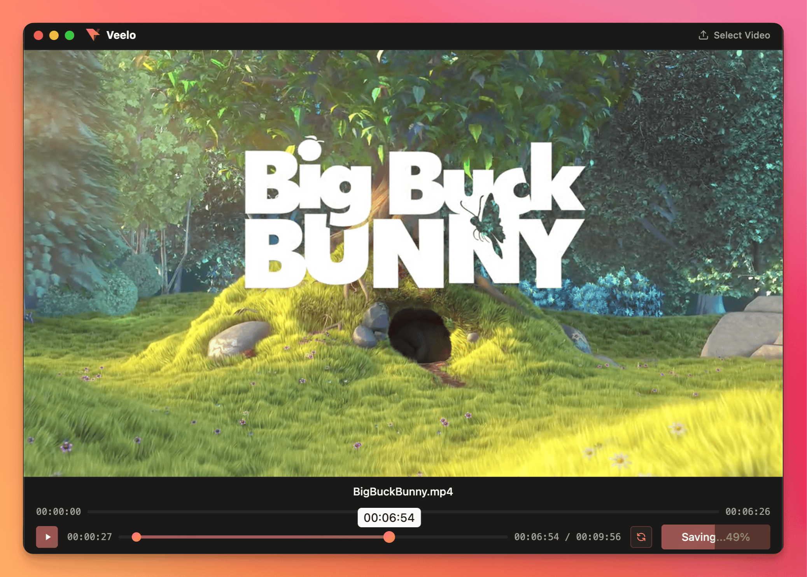
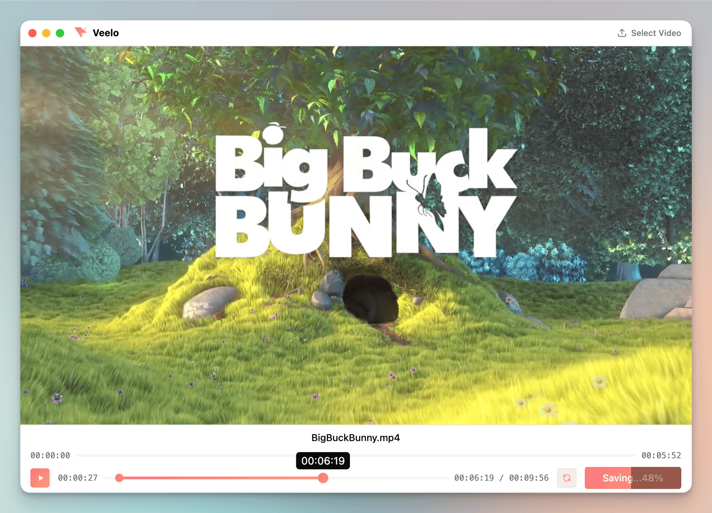

# Veelo

A simple, fast video trimmer for macOS.

## Demo

https://github.com/user-attachments/assets/ce9e7256-c912-430b-89bb-153678c60241

## Screenshots
[](screenshot.png)
[](screenshot-light-mode.png)

## Quick Start

```bash
yarn install
yarn dev
```

**Build for production:**
```bash
yarn build
# App will be in dist/ folder
```

## Usage

1. Drop a video file
2. Drag the timeline handles to trim
3. Click "Cut Video"
4. Done! File saved to Downloads

## Keyboard Shortcuts

### Playback
- `Space` - Play/Pause video
- `R` - Restart from trim start point

### Navigation
- `←` - Seek backward 1 second
- `→` - Seek forward 1 second

### Trimming
- `Shift + ←` - Move left trim point backward (0.5s)
- `Shift + →` - Move left trim point forward (0.5s)
- `Shift + Option + ←` - Move right trim point backward (0.5s)
- `Shift + Option + →` - Move right trim point forward (0.5s)

### Export
- `Enter` - Cut video (saves to Downloads folder)

## Open Files from Finder

### Script Kit Setup

1. Install [Script Kit](https://www.scriptkit.com/)
2. Copy `plugins/script-kit/edit-in-veelo.js` to your Script Kit scripts folder
3. Select a video in Finder, press `cmd + shift + v`

**Shortcut:** `cmd + shift + v` (default, can be customized in the script)

### Raycast Setup

1. Install [Raycast](https://www.raycast.com/)
2. Navigate to `plugins/raycast` and run:
   ```bash
   npm install
   npm run dev
   ```
3. Assign a hotkey in Raycast preferences (e.g., `cmd + shift + v`)
4. Select a video in Finder and trigger the command

**Shortcut:** Custom - assign in Raycast preferences

## Requirements

- Node.js 18+
- FFmpeg (`brew install ffmpeg`)

## License

ISC
